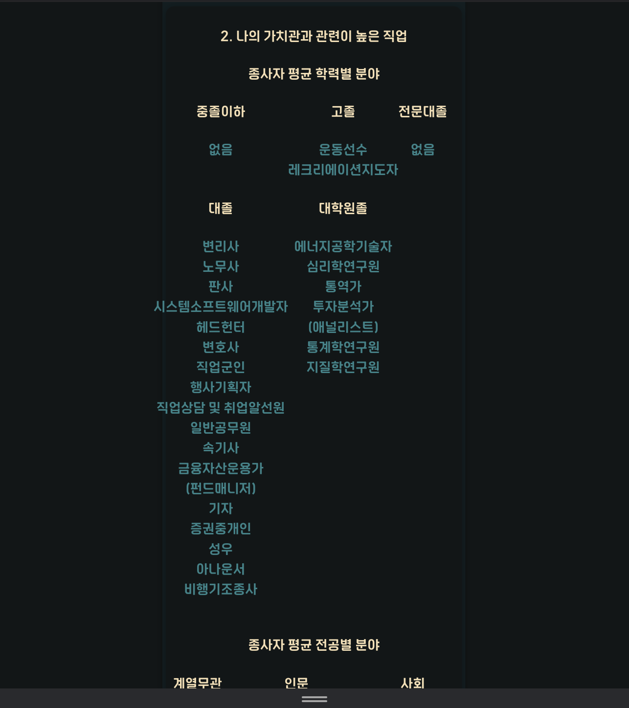

# 개인 프론트엔드 웹개발 프로젝트 [커리어 밸런스 게임: 직업심리검사테스트]

[커리어 밸런스 게임](http://elice-kdt-3rd-vm-085.koreacentral.cloudapp.azure.com/)

## 웹 환경

### 유저 정보 입력 페이지

- 유저의 정보 입력
   

### 정보 입력 포맷 틀릴 시

- 하나라도 미선택하거나, 잘못된 이름 입력 시, 경고 모달을 띄웁니다.
   

### 정보 정상 입력 시 버튼 활성화

- 정상 입력을 마치면, 시작 버튼을 활성화합니다.
   

### 예제 페이지

- 예제 페이지는 테스트의 예시 문제를 보여줍니다.
   

### 예제 미선택 시

- 예시 항목을 선택하지 않으면, 경고 모달을 띄웁니다.
   

### 정보 불러오기 중 로딩 컴포넌트

- 비동기 통신이 일어나는 모든 구간에는 요소를 모두 로드하기 전, 로딩 페이지를 보여줍니다.
   

### 문제 페이지

- 문제 페이지에는 5개 문항 씩 문제가 나열됩니다.
- 문항 당 2개씩 문제가 주어지고, 각 문항에서 문제를 1택하여 진행합니다.
- 선택지를 선택할 때마다 진행 바가 채워지며 퍼센테이지가 높아집니다.
   

### 문제 모두 선택 안할 시, 다음 버튼 비활성화

- 한 페이지에 있는 5개 문제 모두를 선택하지 않으면 다음 버튼은 비활성화 됩니다.
   

### 문제 모두 완료 시, 종료 버튼 활성화

- 모든 문항을 선택 완료시, 종료 버튼이 활성화됩니다.
   

### 테스트 완료 페이지

- 테스트 완료시, 중요시 하는 점 2가지, 중요시 하지 않는 점 2가지를 보여줍니다.
- 추천 직종 최상위 순위 5개를 보여줍니다.
   

### 테스트 결과 페이지 상단

- 테스트 응시자의 이름, 응시 날짜를 보여줍니다.
- 가치관을 차트로 시각화하여 보여줍니다.
   

### 테스트 결과 페이지 하단

- 학력별 추천 직종 리스트를 보여줍니다.
- 전공별 추천 직종 리스트를 보여줍니다.
   

### 재시작 버튼 하단

- 하단의 재시작 버튼을 눌러 초기 화면으로 돌아갑니다.
   

---

## 반응형 전환

### 모바일 유저 정보 입력

 

### 모바일 예제 페이지

 

### 모바일 테스트 페이지-1

 

### 모바일 테스트 페이지-2

 

### 모바일 테스트 완료

 

### 모바일 결과 페이지 상단

 

### 모바일 결과 페이지 중단

 

### 모바일 결과 페이지 하단

 
